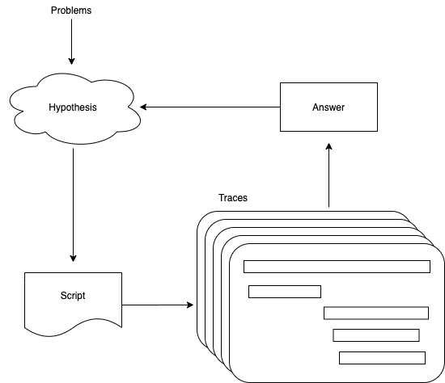
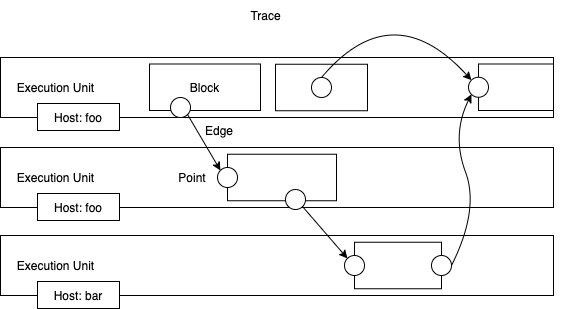
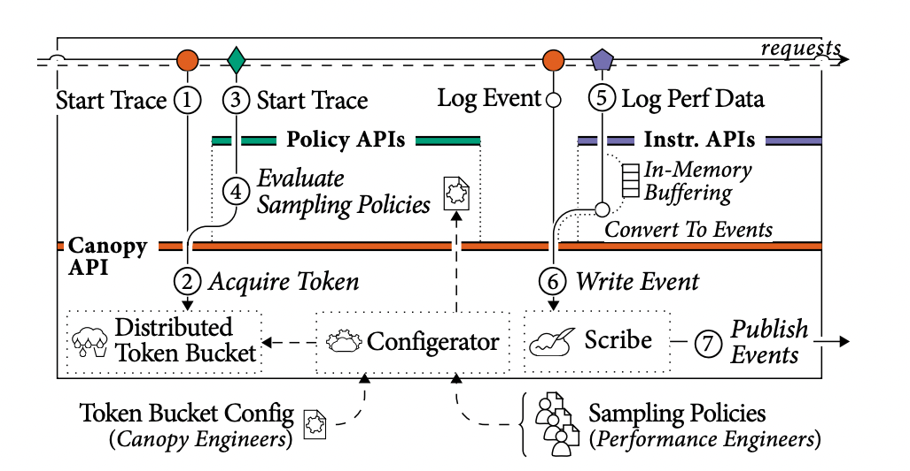
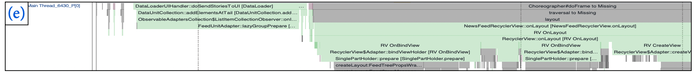
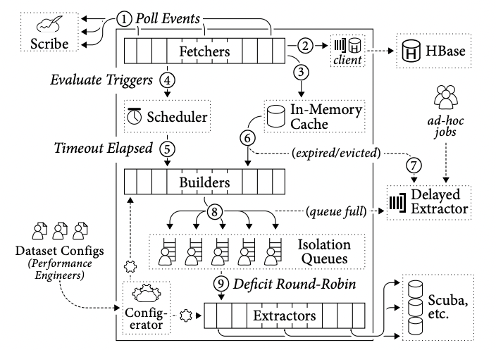

# Canopy

## 基本信息

| 基本信息 | 详情                                               |
| -------- | -------------------------------------------------- |
| 官方网站 | -                                                  |
| 代码仓库 | -                                                  |
| 技术文档 | https://dl.acm.org/doi/pdf/10.1145/3132747.3132749 |
| 开发主体 | Facebook                                           |
| 来源国家 | 美国                                               |
| 开始年份 | 2015*                                              |
| 结束年份 | -                                                  |
| 使用语言 | -                                                  |
| 支持语言 | C/C++/Python/Java/PHP                              |
| 源自于   | X-Trace, Dapper                                    |

## 项目历史

Canopy 是 Facebook 内部使用的端到端性能追踪一体化平台，该平台支持采集移动端、Web 端、服务端上报的埋点数据，对调用链追踪和性能指标数据建模，并向开发者提供可定制化的、可交互的数据分析工具，帮助各端研发掌握全链路服务状态，定位性能问题。Canopy 是闭源项目，约在 2015 年前后在 Facebook 内部上线，2017 年[论文]((https://dl.acm.org/doi/pdf/10.1145/3132747.3132749))发表时，日均采集 13 亿调用链数据，提供 129 组性能数据集。2018 年 Canopy 团队主要成员分别在 [QCon](https://www.infoq.com/presentations/canopy-scalable-tracing-analytics-facebook/) 和 [Distributed Tracing NYC meetup](https://www.youtube.com/watch?v=j6no6JozkZU) 上向外界介绍该项目。

## 使用场景

> 稳态分析

当工程师遇到一些问题时，比如网页加载变慢、性能优化改动上线是否生效等等，常常需要通过一次或多次分析线上调用链数据，来验证自己的猜想或假设，如下图所示：



Canopy 支持工程师通过使用 Jupyter Notebook 编写简单的 Python 脚本，处理线上采集的调用链数据，分析并得到结果。在 Canopy 论文末尾介绍了若干 Facebook 内部的案例分析：

* Causal Ordering：定位一个低优先级页面时常出现在高优先级页面加载路径上的原因
* Regressions in Subpopulations：全局页面加载时间平均下降了 50ms，分析后发现只是某个地区的网络被切断，属于不可抗力
* Identifying Improvements：利用 Canopy 发现页面静态资源加载不全，补全后成功优化页面加载时延
* ...

不难看出，这些分析都涉及分析大量调用链数据，获得对系统整体的洞见，这些都属于稳态分析的范围。

## 调用链数据模型

> 自研

Canopy 的调用链数据模型由五部分组成：Execution Unit、Block、Point、Edge 以及 Annotations，如下图所示：



Execution Unit 是具备本地时钟的运行单元，通常表现为一个线程；Block 是 Execution Unit 一段执行区间；Point 是 Block 中的任意时刻；Edge 连接两个 Point，表达因果关系，这里即可以同步也可以是异步关系；Annotations 可以标记上述的任意元素，用于记录辅助信息。

## 元数据结构

> 动态定长

在上述调用链数据模型之下，Canopy 最底层的数据采集单元实际上是事件 (Event)，其结构如下所示：

```thrift
struct Event {
	1: required string taceID;
	2: required string type;
	3: required string id1;
	4: optional string id2;
	5: optional i64 sequenceNumber;
	6: required i64 timestamp;
	7: optional map<string, string> annotations;
}
```

这些事件将在后续处理阶段按上述调用链数据模型的设计来解析。Canopy 使用序列号和时间戳来为线程或进程内部的事件排序，需要追踪跨进程因果关系时，则会生成一个 EventID，将 EventID 与 TraceID 一起传播到请求接收方。可以看出，对于同一个请求，TraceID 全局唯一，而 EventID 随着执行单元的变化而变化，其元数据结构属于动态定长。

## 采样策略

> 头部连贯采样

对于 Facebook 的业务体量来说，追踪所有请求并不现实，因此 Canopy 在设计上只为追踪一小部分请求，如下图所示：



在开启追踪前，埋点 SDK 必须先从分布式令牌桶 (distributed token bucket) 中获取一个令牌，如果获取失败则不采集。Canopy 的工程师会为不同的租户设定不同的限流阈值，其默认值为 5。但限流策略的弊端在于请求量小的请求容易被忽视，为此 Canopy 为每个租户额外增加了自定义采集配置的功能，让租户们能够细粒度地控制自己的令牌分发逻辑，但前提是不超过全局配置的限流阈值。

本质上 Canopy 支持的采样策略属于头部连贯采样。

## 数据可视化

> 火焰图等

Canopy 中许多可视化组件针对特定场景，解答复杂问题的数据聚合分析设计，不属于本文讨论范围。在论文中提到 Canopy 支持用多种可视化方案来分析不同端的调用链信息，唯一具体提到的例子是利用火焰图分析调用链性能瓶颈，如下图所示：



相信后端服务也会有类似甘特图或调用图的可视化方式支持，但鉴于论文中未具体介绍，这里就不妄议了。

## 可扩展性

Canopy 的 tailer 模块负责接收、处理和持久化调用链数据，它既要处理所有数据，还要保障数据处理的时效性，其结构如下图所示：



**事件路由 (Routing Events)：**埋点 SDK 会将事件数据直接上报到消息中间件 Scribe 中，后者将所有事件按 TraceID 分片，保证所有隶属同一个调用链的事件数据进入同一个 tailer 分片中。(①) fetcher 池中的多个 fetcher 线程会不断轮询 Scribe、处理事件数据。首先这些事件数据会被立即写入 HBase (②)，然后被插入到本地缓存中 (③)，后者将同样按照 TraceID 将事件数据分组，所有数据都将被设置 15 分钟的过期时间，如果缓存大小到达上限，则将最早的数据清出，即 LRU，为了防止同一个调用链的事件数据又重新进入缓存，tailer 中还维持额外的 TraceID 缓存，用于存储最近 5 小时出现过的 TraceID。

**事件处理 (Handling Events)**：fetchers 的另一个职责就是决定一个调用链的数据什么时候可以被处理。在不确定的网络环境中，我们完全不能保证事件数据到达的时间和顺序，fetchers 能做的就是按照一定的规则匹配调用链数据，为不同的调用链配置不同的等待时间 (⑤)。如网页访问通常等待 10 分钟，而自动打包、部署系统则等待 1 天。

**负载保护 (Load Shedding)**：当 fetchers 确定调用链数据可以处理后，builders 池中的某个 builder 线程会尝试从本地缓存中获取该调用链中的事件数据 (⑥)，如果发现无法从缓存找到，则将调用链数据丢进延迟提取器 (Delay Extracter) 中 (⑦)，后者会通过 HBase 中的数据做相同处理。

**数据建模 (Model Construction)**：builder 取得调用链数据后，利用各种组装、修复、验证逻辑为事件数据建立模型，处理成 "调用链数据模型" 一节介绍的形式。

**特征抽取 (Feature Extraction)**：builders 会读取用户定义的 dataset 配置，每个配置定义了特征数据的归属租户、过滤器、抽取表达式以及最终存储服务信息。建模完毕后，builder 将数据按照租户投递到不同的队列中 (⑧)，通常这个队列很短，如果 builder 无法将数据投递进去，则该调用链数据会被直接丢弃，同时写入延迟提取器中。extractors 池中的每个 extractor 线程会按照 round-robin 的方式公平地从每个租户队列中获取，它们接着根据用户配置，执行抽取表达式，将结果写入对应的存储服务中，如 Scuba、Hive 等。

其可扩展性设计表现在以下几个方面：

* 事件路由根据 TraceID 分片，保证所有归属于同一个调用链的数据进入同一个分片，不同 tailer 实例间无需通信，支持横向扩展。因为 TraceID 是随机生成，负载均衡的效果有保证。目前 Canopy 的吞吐量在 1.16 GB/s，这离 Scribe 的性能上限相去甚远。
* 随着内部组件的日趋完善，单个调用链产生的事件数逐渐增加，后端服务平均事件数约为 160，浏览器平均事件数大于 4500，移动端则大于 7500。这些或多或少地增加了运行时的处理负担，为了解决这方面问题，Canopy 团队引入了多级别的调用链信息，引导使用者从粗粒度级别开始上手。
* 因为延迟提取器的存在，当请求过载时数据会被延迟处理，且不影响当前实时数据处理，还能保持对租户的公平性。

## 参考资料

* [Canopy: An End-to-End Performance Tracing And Analysis System](https://dl.acm.org/doi/pdf/10.1145/3132747.3132749)
* [Canopy: Scalable Distributed Tracing & Analysis @ Facebook](https://www.infoq.com/presentations/canopy-scalable-tracing-analytics-facebook/)
* [Distributed Tracing - NYC: Tracing @ Facebook](https://www.youtube.com/watch?v=j6no6JozkZU)

