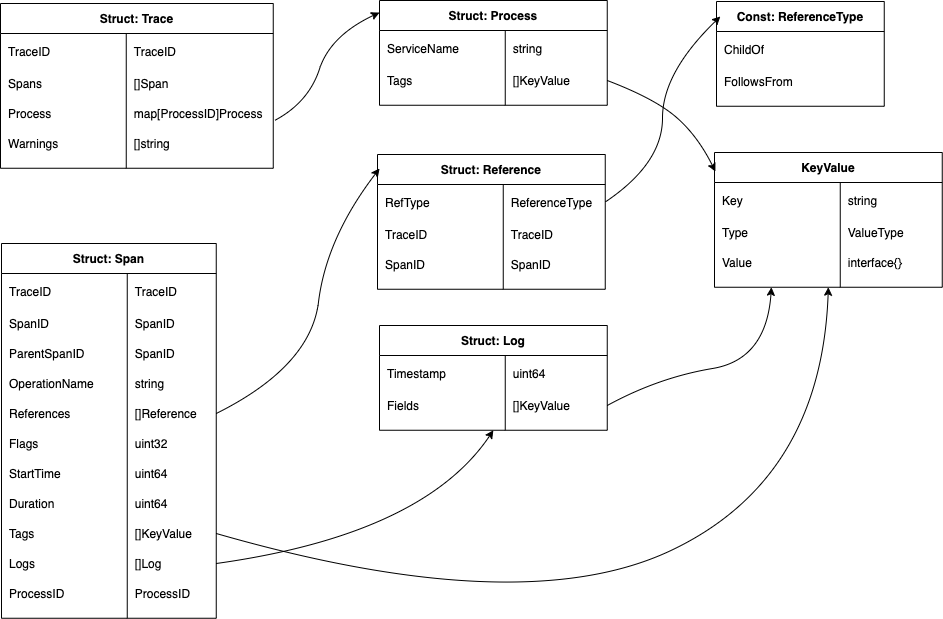
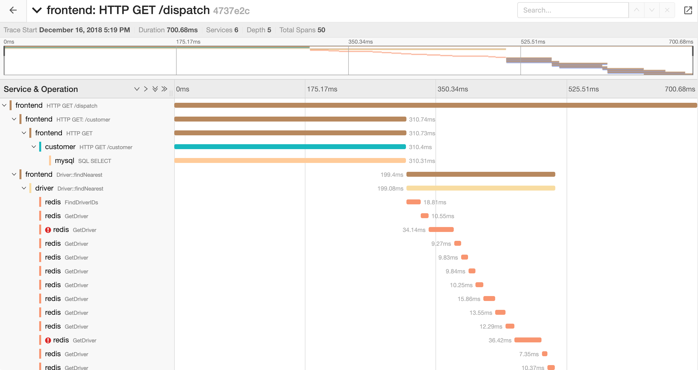
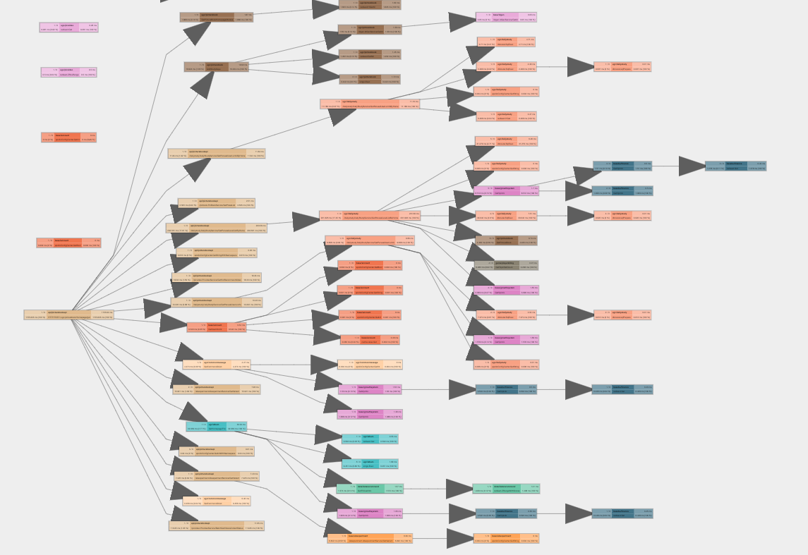
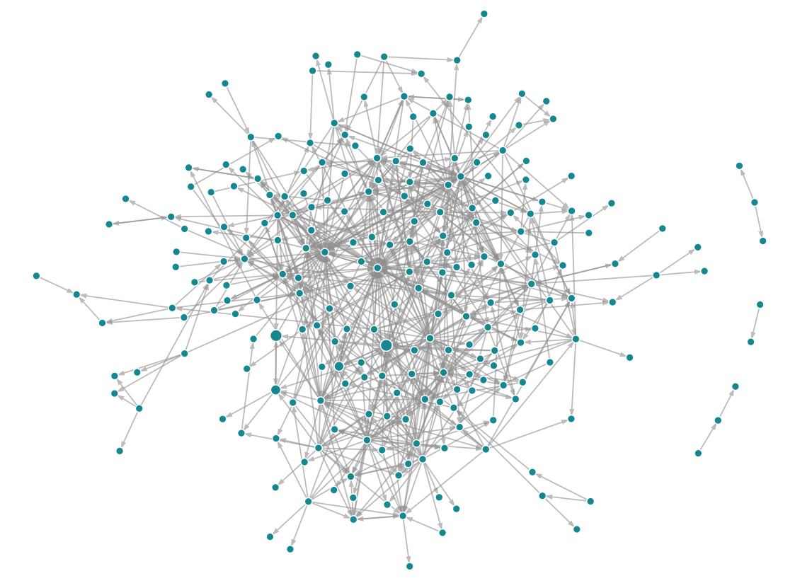
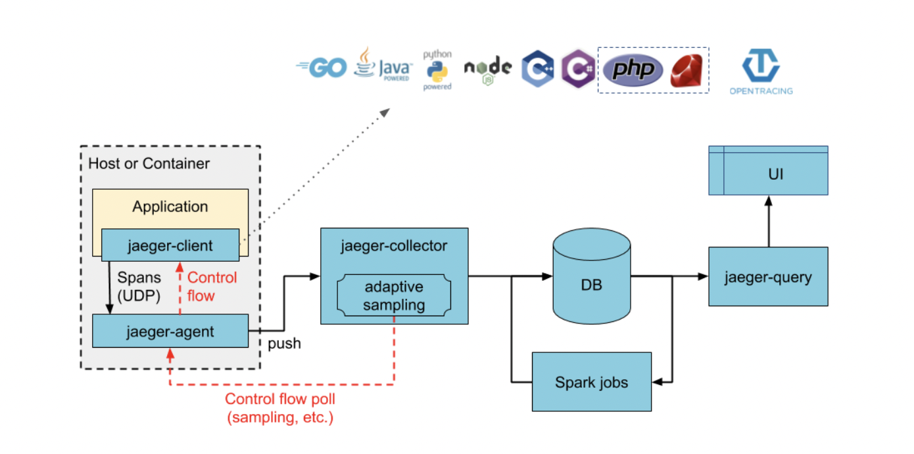
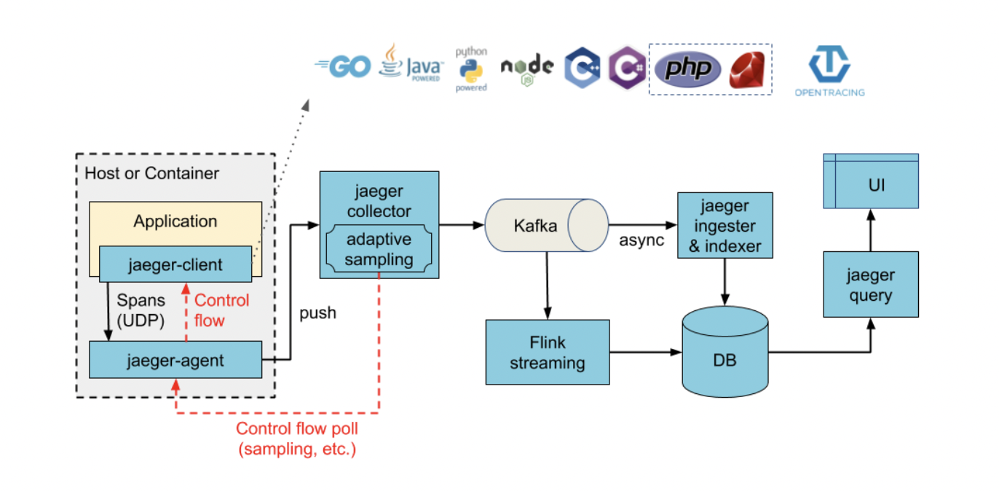

# Jaeger

## 基本信息

| 基本信息 | 详情                                     |
| -------- | ---------------------------------------- |
| 官方网站 | https://www.jaegertracing.io/            |
| 代码仓库 | https://github.com/jaegertracing/jaeger  |
| 技术文档 | https://www.jaegertracing.io/docs/       |
| 开发主体 | Cloud Nature Computing Foundation (CNCF) |
| 来源国家 | 美国                                     |
| 开始年份 | 2016                                     |
| 结束年份 | -                                        |
| 使用语言 | Go                                       |
| 支持语言 | Go, Java, Python, C++, C#                |
| 源自于   | Dapper, OpenZipkin                       |

## 项目历史

Jaeger 的名字源于德语中的猎人，是由 Uber 内部 Observability 团队开发，集成埋点、收集到可视化的完整调用链追踪解决方案。2017 年 4 月 Jaeger 正式开源；2017 年 9 月进入 CNCF 孵化；2019 年 10 月正式从 CNCF 毕业，成为 CNCF 顶级项目。

## 使用场景

>  稳态分析

Jaeger 在官网上介绍自己的主要功能如下：

* 分布式上下文传播 (Distributed context propagation)
* 分布式事务监控 (Distributed transaction monitoring)
* 根因分析 (Root cause analysis)
* 服务依赖分析 (Service dependency analysis)
* 性能/时延优化 (Performance/latency optimization)

重建调用链关系需要在进程间传播元数据，因此分布式上下文传播其实是实现调用链追踪数据建模的基础，我们通常不会使用它来传播非调用链追踪相关的数据，如 uid、did 等等。这些数据一般会通过微服务治理框架来传播。后面的分布式事务监控、根因分析、服务依赖分析、性能/时延优化，主要是通过采集侧收集上来的调用链数据及服务 (service)、操作 (operation) 的依赖关系，分析系统行为。

## 调用链数据模型

> Span Model

Jaeger 中调用链数据模型遵守了 opentracing 标准，使用的是典型的 Span Model，其核心数据结构如下图所示：



下面是一个具体的例子：

```
# source: https://github.com/opentracing/specification/blob/master/specification.md
Causal relationships between Spans in a single Trace


        [Span A]  ←←←(the root span)
            |
     +------+------+
     |             |
 [Span B]      [Span C] ←←←(Span C is a `ChildOf` Span A)
     |             |
 [Span D]      +---+-------+
               |           |
           [Span E]    [Span F] >>> [Span G] >>> [Span H]
                                       ↑
                                       ↑
                                       ↑
                         (Span G `FollowsFrom` Span F)
```

其中 Span 与 Span 之间存在两种因果关系，ChildOf 和 FollowsFrom。ChildOf 关系中，父节点依赖于子节点执行的结果；FollowsFrom 关系中，父节点不依赖于子节点执行的结果，但与之存在因果关系。

## 因果关系

> 用户决定，触发者视角为主

Jaeger 采用的调用链数据模型完全能够关联同一个请求中的不同进程，是提交者视角还是触发者视角则取决于 Jaeger 的接入方，选择触发者视角对接入方不存在额外的成本，而选择提交者视角则需要接入方投入额外的精力做定制化开发。因此在绝大多数情况下使用的是触发者视角。

## 元数据结构

>  动态定长

Jaeger 在进程间传递的元数据结构如下：

```go
// source: https://github.com/jaegertracing/jaeger-client-go/blob/master/span_context.go
// SpanContext represents propagated span identity and state
type SpanContext struct {
	// traceID represents globally unique ID of the trace.
	// Usually generated as a random number.
	traceID TraceID
	// spanID represents span ID that must be unique within its trace,
	// but does not have to be globally unique.
	spanID SpanID
	// parentID refers to the ID of the parent span.
	// Should be 0 if the current span is a root span.
	parentID SpanID
	// Distributed Context baggage. The is a snapshot in time.
	baggage map[string]string
	// debugID can be set to some correlation ID when the context is being
	// extracted from a TextMap carrier.
	//
	// See JaegerDebugHeader in constants.go
	debugID string
	// samplingState is shared across all spans
	samplingState *samplingState
	// remote indicates that span context represents a remote parent
	remote bool
}
```

利用 traceID 可以确认当前 span 的归属关系；利用 spanID 和 parentID 可以建立上下游进程的父子关系。通常 baggage 中的数据量不会变化。综合考虑：Jaeger 的元数据结构属于动态定长。

## 采样策略

> 头部连贯采样

目前 Jaeger 支持三种采样方式：

* Constant：要么全采样，要么不采样
* Probabilistic：按固定概率采样
* Rate Limiting：限流采样，即保证每个进程每隔一段时间最多采 k 个

除了在 sdk 初始化时直接写死采样配置外，Jaeger 还支持远程动态调整采样方式，但调整的选择范围仍然必须为上面三种之一。为了防止一些调用量小的请求因为出现概率低而无法获得调用链信息，Jaeger 团队也提出了适应性采样 (Adaptive Sampling) ，但这个提议从 2017 年至今仍然未有推进。

无论是上述哪种方式，是否采样这一决定都是在请求进入系统之时决定，因此结论是：目前 Jaeger 支持头部连贯采样。值得一提的是，Jaeger 团队也在讨论[引入尾部连贯采样的可能性](https://github.com/jaegertracing/jaeger/issues/425)，但尚未有结论。

## 数据可视化

> 甘特图、调用树、调用图

jaeger-ui 项目提供了丰富的调用链数据可视化支持，包括针对单个请求的甘特图、调用树，以及全局服务的调用图。

### 甘特图



### 调用树



调用树目前仍在实验阶段，暂时还不是正式功能。

### 调用图



同时还可以聚焦到某个节点，让调用图只显示与该节点相关的服务，即焦点图 (focus graph)。

## 可扩展性

Jaeger 有两种部署架构选择，分别如下面两张图所示：






二者大致结构相同，主要区别在于 jaeger-collector 与 DB 之间加了 Kafka 做缓冲，解决峰值流量过载问题。整个 Jaeger 后端不存在单点故障，Jaeger-collector、Kafka、DB (Cassandra 和 ElasticSearch) 都支持横向扩展。

## 参考资料

* [Evolving Distributed Tracing at Uber Engineering](https://eng.uber.com/distributed-tracing/)
* [Jaeger docs: Introduction](https://www.jaegertracing.io/docs/)
* [Jaeger docs: Sampling](https://www.jaegertracing.io/docs/sampling/)
* [Jaeger ui: pull request #276](https://github.com/jaegertracing/jaeger-ui/pull/276)
* [opentracing specification](https://github.com/opentracing/specification/blob/master/specification.md)

