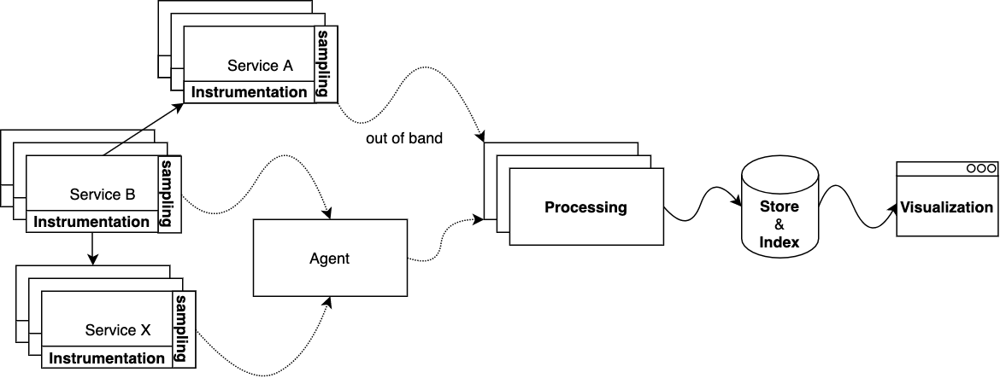

# 基本架构

尽管市面上存在各式各样的调用链追踪系统，但它们的基本架构相对一致：

### 埋点

每个微服务会在跨进程的连接处埋点 (instrumentation)，如：

* 发送 HTTP/RPC 请求，接收 HTTP/RPC 响应
* 数据库查询
* 缓存读写
* 消息中间件的生产及消费
* ...

每个点上会记录跨进程操作的名称、开始时间、结束时间以及一些必要的标签键值对，这些信息是整个调用链拼图中的一片。

### 采样

实践中无论从计算和存储资源成本消耗上分析，还是从具体使用场景出发，都不一定需要收集所有埋点数据。因此许多调用链追踪系统会要求按照一定的策略上报数据，目的是取得成本与收益之间的平衡，提高投入产出比。

### 上报

数据可以从服务实例中直接发送到处理中心，或经由同一宿主机上的 agent 代理上报。使用 agent 上报的好处之一在于一些计算操作可以在 agent 中统一处理，一些逻辑如压缩、过滤、配置变更等可以集中到 agent 中实现，服务只需要实现很薄的一层埋点、采样逻辑即可，这也能使得调用链追踪方案对业务服务本身的影响降到最低；使用 agent 上报的另一好处是数据处理服务的发现机制对服务本身透明。因此在每台宿主机上部署 agent 是许多调用链追踪系统的推荐部署方案。

### 处理

调用链数据上报到处理中心，通常称后者为收集器 (collector)，由收集器完成必要的后处理，如数据过滤、数据标记、尾部采样、数据建模等等，最后批量写到不同的存储服务中，并建立必要的索引。

### 存储/索引

调用链追踪数据主要有两个特点：体量大、价值随时间的推移而降低。因此存储服务的选型除了数据模型之外，还需要考虑可扩展性以及数据保留策略 (retention policy) 的支持。另外为了便于查询，我们还需要为数据的存储建立合适的索引。

### 可视化

可视化是高效利用调用链数据的最重要一环，高质量的交互体验能帮助研发快速获取所需信息。通常我们可以将可视化分为两种粒度：单个调用链查看、多个调用链聚合分析，在每个粒度上都有许多可视化方案选择。

### 可扩展性

如果不做任何采样，调用链追踪系统需要处理的数据与全站的请求总量正相关。假如全站所有请求平均要经过 20 个服务处理，那么调用链追踪系统将需要承担全站请求总量 20 倍压力，因此其架构设计上的每一层都需要具备可扩展性。

如果采用服务 SDK 直接上报，那么上报层的横向扩容就自动地通过实例的增加实现；如果采用 agent 代理的上报形式，那么横向扩容就可以通过增加宿主机来实现。数据处理层理论上应该是无状态的，支持横向扩容。由于许多调用链数据的处理逻辑需要获取同一调用链的所有数据，那么通过 TraceID 做负载均衡是天然的选择；数据的存储可扩展性会由所使用的存储服务保证。

### 过载控制

瞬时高峰是常见的流量负载模式，因此调用链追踪系统的各个组件也需要考虑过载控制逻辑。既要防止在峰值流量下埋点及上报对在线服务的影响，也需要考虑调用链追踪后端各模块的承载能力。

在数据上报和处理的过程中，agent 或 collector 可以通过维持本地队列来削峰，但如果超出局部队列的容量限制，就要考虑数据丢失与时效性之间的权衡。如果可以容忍数据丢失，就可以像路由器丢包似的直接丢掉无法处理的数据；如果可以放弃峰值时效性，则可以通过高吞吐、存储容量高的消息中间件，如 Kafka，来代替局部队列。