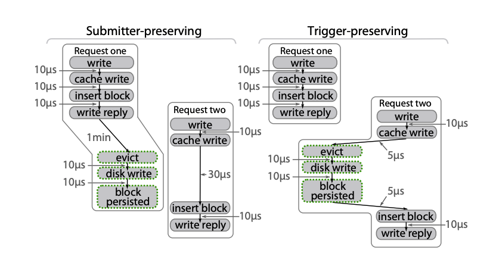

# 因果关系

同一个请求的不同 spans 之间可能存在因果关系，如：

* 请求 R1 处理过程中，进程 P1 通过 HTTP 或 RPC 调用进程 P2
* 请求 R1 处理过程中，进程 P1 写入数据到存储服务中，或从存储服务中读取数据
* 请求 R1 处理过程中，进程 P1 生产消息到 MQ 中，进程 P2 消费到消息并处理
* ...

不同请求的 spans 之间也可能存在因果关系，如：

* 请求 R1 和 R2 同时获取某分布式锁，R1 成功，R2 失败
* 请求 R1 写入数据到本地缓存后请求 R2 也写入数据，同时触发批处理
* 请求 R1 写入数据到存储系统后请求 R2 读出对应数据进行处理
* ...

每个请求相关的所有因果关系可以用有向无环图 (DAG) 表示，暂且称之为因果关系全图。首先，每个调用链追踪系统需要决定的是**哪些因果关系需要被记录**？其次，由于一个请求的 span 可能会与另一个请求的 span 产生关联，通常每个 span 只会隶属于一个 trace，那么每个调用链追踪系统还需决定**与多个请求关联的 span 最终应该归属给哪个请求**？

第一个决定标准通常比较简单：能采集的就采集；关于第二个决定，调用链追踪系统则可能根据使用场景的不同而做出不同的选择，我们可以从两个角度出发分析：提交者角度和触发者角度。

## 提交者角度 (Submitter-preserving)

提交者角度意味着，当聚合或批处理操作被另一个请求触发时，该操作将被归属于始作俑者，即提交者。如上方左图所示：Request one 留存在 write-back cache 中的数据因为 Request two 写入数据而最终被清出到磁盘，此时清出数据到磁盘的操作归属于 Request one。

## 触发者角度 (Trigger-preserving)

触发者角度意味着，当聚合或批处理操作被另一个请求触发时，该操作将被归属于触发者。如上方右图所示：Request one 留存在 write-back cache 中的数据因为 Request two 写入数据而最终被清出到磁盘，此时清出数据到磁盘的操作归属于 Request two。