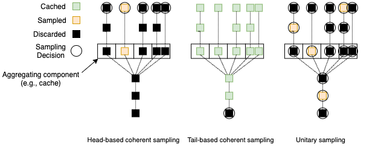

# 采样策略

调用链数据总体体量与业务体量正相关，全量采集调用链数据将会给公司系统整体带来两方面压力：

* 因数据上报造成的每个业务服务的网络 I/O 压力
* 因数据采集、分析造成的调用链追踪服务的计算和存储压力

为了降低这两方面压力，采样是大多数调用链追踪系统的必备模块。实践中常用的采用策略可以分为三类：

* 头部连贯采样：Head-based coherent sampling
* 尾部连贯采样：Tail-based coherent sampling
* 单元采样：Unitary sampling

它们的示意图如下所示：

## 头部连贯采样

头部连贯采样指的是请求进入系统时就立即决定是否采样，并且这个决定会随着元数据被传递到下游服务，保证采样的连贯性。由于采样决定做得早，对系统整体带来的压力较小。但也正因为决定做得早，采样的准确度也最低，很难保证采集到的调用链都有意思。

### 变体1：头部连贯采样 + 异常回溯上报

在头部连贯采样的同时，于每个服务节点缓存最近的若干 spans 信息，一旦下游调用出现异常，则可在微服务框架中感知同时回溯到上游节点，保证出现异常的调用链数据能被上报。

## 尾部连贯采样

尾部连贯采样指的是在请求完成时才决定是否采样。在决定之前，系统需要将数据缓存起来，以保证采样的连贯性。由于采样决定做得晚，数据需要全量上报并临时存储一段时间，这将加重上文提到的两方面压力。但也正因为决定做得晚，获取的信息更全，尾部连贯采样能利用一些经验性的规则保证重要的调用链被采集。

## 单元采样

单元采样并不要求连贯性，系统中的每个组件自行决定是否采样，因此这种方案通常无法建立单个请求的调用链信息。

