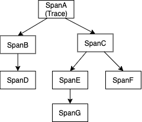
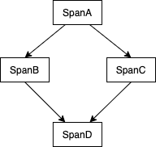
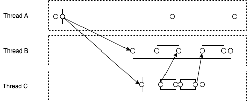

# 调用链数据模型

每个调用链追踪系统实现都需要为调用链数据合理建模，它们对数据模型的选择可能影响到埋点、收集、处理、查询等各个环节。其中最常见的数据模型就是 Span Model 和 Event Model，想了解详情可阅读这篇[文章](http://cs.brown.edu/~rfonseca/pubs/leavitt.pdf)。

## Span Model

Span Model 最早由 Google [提出](http://static.googleusercontent.com/media/research.google.com/zh-CN//archive/papers/dapper-2010-1.pdf)，它将一次计算 (computation) 任务，如处理用户请求，表达成一组 spans 集合，其中每个 span 表示计算任务的一部分 (segment)，记录着开始时间和结束时间。其中每个 span 还记录着触发它的 span，即 parent span，标志着系统中的因果关系。假设 `SpanA` 触发了 `SpanB`，那么 `SpanA` 就是 `SpanB` 的父节点。由于父子关系意味着因果关系，那么 spans 之间组成的关系不会形成环，否则就会出现因果循环。因此通常同一个 trace 的 spans 关系可以使用一棵树表示，举例如下：

需要注意的是：在 Span Model 中，每个 span 都只存在一个父节点，即导致某段计算发生的原因只有一个。使用 Span Model 的追踪系统在埋点时需要主动停止 span，停止之后该段计算的信息会被上报到处理中心。从逻辑上看，子节点完成上报后，父节点才会上报；从上报通路上看，二者都由本地线程上报，并无关系。

Span Model 单因多果的关系与调用栈在概念上十分契合，很容易被工程师理解和掌握。然而它并不足以表达所有类型的计算依赖关系，如多因一果：

## Event Model

[X-Trace](http://www.icsi.berkeley.edu/pubs/networking/xtrace07.pdf) 是最早使用 Event Model 的项目。在 X-Trace 中，一个事件 (event) 是计算任务中的一个时刻，计算任务中的因果关系由事件之间的边 (edges) 表示，任意两个事件都可以用一条边连接。值得注意的是，这里的 edge 表示的实际上是 [Lamport (1978)](https://lamport.azurewebsites.net/pubs/time-clocks.pdf) 中提到的 "happens-before" 关系，假设有一条边从 EventA 连到 EventB，那么 "happens-before" 那么 EventA 可能对 EventB 产生影响。但在简单场景下，我们可以直接认为边指代激活关系 (activation relationship) 或依赖关系 (dependency relationships)，二者都是 "happens-before" 关系的子集。与 Span Model 不同的是，Event Model 中每个事件可以有多条入边 (incoming edges)，这让 Event Model 可以轻松表达复杂关系，如 fork/join 或 fan-ins/fan-outs 关系。Event Model 支持更精细化的调用链数据展示，举例如下：

其中虚线框表示某个执行线程；圆点表示事件；箭头表示边。为了便于理解和对比，图中也用实线方框表示 span。

Event Model 的优势在于表达力强，但缺点是相比 Span Model 更加复杂，对工程师来说更不易接受和上手，同时 Span Model 的类似调用栈的可视化也更加简洁。

## 参考资料

* [End-to-End Tracing Models: Analysis and Unification](http://cs.brown.edu/~rfonseca/pubs/leavitt.pdf)
* [Dapper, a Large-Scale Distributed Systems Tracing Infrastructure](http://static.googleusercontent.com/media/research.google.com/zh-CN//archive/papers/dapper-2010-1.pdf)
* [X-Trace: A Pervasive Network Tracing Framework](http://www.icsi.berkeley.edu/pubs/networking/xtrace07.pdf)
* [Time, Clocks, and the Ordering of Events in a Distributed System](https://lamport.azurewebsites.net/pubs/time-clocks.pdf)

