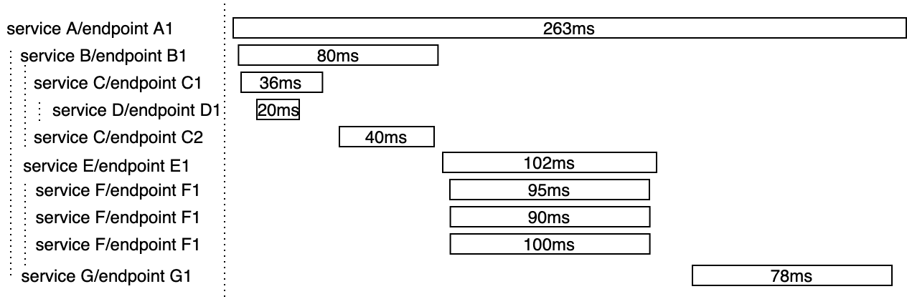
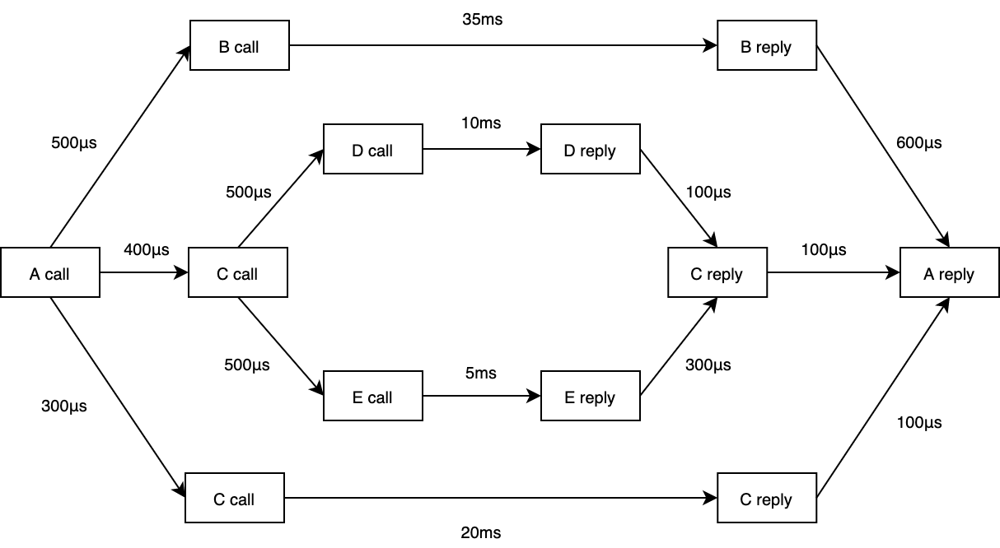
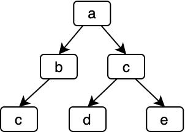
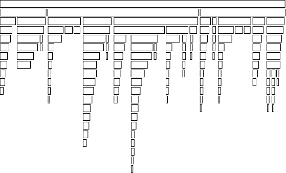

# 数据可视化

调用链数据的可视化通常与使用场景一一对应，高效的可视化形式能更好地赋能工程师，缩短故障排查时间，提升研发生活质量。

## 甘特图 (Gantt charts)

甘特图常被用于展示单个请求的调用链数据，以下是调用链追踪系统最常用的甘特图变体：

图的左边通常组织为树状结构，通常父节点表示调用方，子节点表示被调方，兄弟节点之间为并发关系，且从上至下时间单调递增；图的右边展示的是与标准甘特图类似的条状结构。

## 流程图 (Flow graphs)

流程图常被用于展示多个相似请求调用链数据的聚合信息，这些请求的调用链结构应该完全一致。举例如下：

图中的节点表示系统中发生的事件，边表示因果关系，权重可以表示事件发生的时间差，它们共同组成一个有向无环图。流程图甚至可以表达 fan-outs 和 fan-ins，即 forks 和 joins 的因果关系，能保留更多的调用链细节信息。

## 调用图 (Call graphs)

调用图被用于展示多个请求的聚合信息，这些请求的调用链结构无需完全一致。调用图上的节点表示系统中的服务、模块或接口，边表示因果关系，权重则可以表示流量、资源占用等自定义信息。调用图中可能出现环，意味着系统中存在环形依赖。调用图示例如下：

## 调用树 (Calling Context Trees)

调用树被用于展示多个请求的聚合信息，这些请求的调用链结构通常不同。调用树根节点到任意叶子节点的路径都是分布式系统中真实存在的调用路径，举例如下：

## 火焰图 (Flame graph)

火焰图常被用于展示单机程序调用栈耗时信息，如 Go 中的 pprof。它与调用树的结构类似，常被用于展示多个请求的聚合信息，但展示形式不同，能更直观地展示各个组件的耗时信息，举例如下：

